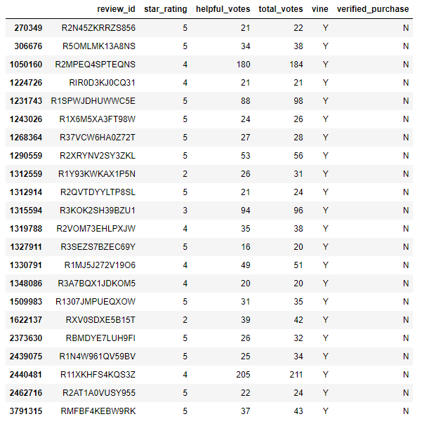
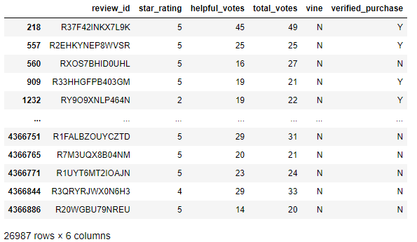
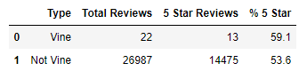

# Amazon_Vine_Analysis

## Overview of the analysis: Explain the purpose of this analysis.

The purpose of this analysis was to use AWS, Colab notebooks, SQL, and pandas to review Amazon review data. Using Amazon datasets, we used Google Colab notebooks to create tables related specifically to reviws for shoes. Then using pgAdmin and AWS, this data was stored in an SQL database. From here one table was exported specifically data that shows review rating, helpful votes, total votes, whether the review was a Vine review, and if the purchase was verified. This data was then reviewed using pandas in a Jupyter notebook to compare the percent of 5 star reviews for all reviews compared to Vine reviews. below is a random sampling from the vine data.

This data was then filtered to use only reviews with 20 or more votes and more than 50% helpful rating. This resulted in 25,136 reviews. It was then broken into the following two datasets. One for only Vine Reviews, and the other for non-Vine reviews.

## Results: 

Using the information above, the total number of Reviews, the number of 5 star reviews, and the percent of 5 star reviews was calculated. This is summarized in the table below.

Based on this analysis the following was observed:

    * There were 20 Vine reviews and 25,116 non-Vine reviews
    * There were 12 Vine review with 5 stars, compared to 13479 of non-Vine reviews
    * 60% of Vine reviews were 5 stars, compared to 53.7% of non-Vine reviews

## Summary: 

Vine reviews have a slightly higher percenatage of 5 star reviews than non-Vine reviews, 60% vs 53.7%.  An additional analysis using this data set, could include looking at the mean star ratings for each group. The mean for Vine ratings is 4.24 compared to 3.85 for non-Vine reviews. The Vine review have higher star ratings on average. However, the sample size of Vine review is much smaller than non-Vine reviews, so the higher ratings and percent of 5 star reviews may not be a true bias, but related more to sampling size.